FLowchart for the `apply-drawing` api route in the `pdf_service` server. Copy/paste this code block into an site like https://mermaid.live/ (Google "Mermaid charts" and choose your preferred one) or you can download an IDE extension and view the diagram as a markdown preview.

```mermaid
flowchart TD
    A[User clicks 'Edit' on PDF page] --> B[PDFDrawingCanvas opens]
    B --> C[User adds rectangular annotations]
    C --> D[User clicks 'Save']
    D --> E[Frontend: handleSaveDrawing called]

    E --> F[Create FormData with:]
    F --> G[- Original PDF file<br/>- Page number<br/>- Drawing data JSON]

    G --> H[POST /api/v1/pdf/apply-drawing]
    H --> I[JWT Auth Middleware Check]

    I --> |Auth Failed| J[Return 401 Unauthorized]
    I --> |Auth Success| K[ApplyDrawing Handler]

    K --> L{Validate File Upload}
    L --> |No file| M[Return 400: No file uploaded]
    L --> |Not PDF| N[Return 400: Not a PDF]
    L --> |Valid PDF| O[Extract form data]

    O --> P[Create multipart form for PDF service]
    P --> Q[Copy PDF file to form]
    Q --> R[Copy all form fields to new request]
    R --> S[Close multipart writer]

    S --> T[Forward to PDF Service<br/>POST /api/v1/internal/pdf/apply-drawing]

    T --> U{PDF Service Processing}
    U --> |Error| V[Return 500: Processing failed]
    U --> |Success| W[Parse drawing data JSON]

    W --> X{Validate Drawing Data}
    X --> |Invalid JSON| Y[Return 400: Invalid drawing data]
    X --> |Missing data| Z[Return 400: No drawing data]
    X --> |Valid| AA[Open original PDF]

    AA --> BB[Create new PDF document]
    BB --> CC[Copy all pages to new document]
    CC --> DD[Get target page for modification]

    DD --> EE[Process vector shapes]
    EE --> FF{For each rectangle shape:}
    FF --> GG[Create rect annotation]
    GG --> HH[Set position and dimensions]
    HH --> II[Set black color and opacity]
    II --> JJ[Update annotation]

    JJ --> KK[Save modified PDF with high quality]
    KK --> LL[Return PDF as download]

    LL --> MM[Root server forwards response]
    MM --> NN[Client receives modified PDF blob]

    NN --> OO[Generate new preview]
    OO --> PP[POST /api/v1/pdf/pdf-to-image]
    PP --> QQ[Update page preview in state]
    QQ --> RR[Close drawing mode]

    style A fill:#e1f5fe
    style B fill:#e8f5e8
    style K fill:#fff3e0
    style T fill:#f3e5f5
    style AA fill:#ffebee
    style NN fill:#e8f5e8

```

